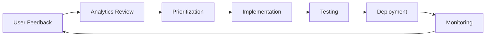

# OMNI Intelligence Platform - Dashboard Enhancement Strategy

## 📋 Executive Summary

This document provides a comprehensive strategy for enhancing the OMNI Intelligence Platform based on professional UX/UI principles, modern web application standards, and user engagement best practices. The strategy integrates all discussed recommendations into a cohesive, actionable implementation plan.

---

## 🎯 Strategic Pillars

### 1. **Personalization & User-Centric Design**
### 2. **AI-Powered Intelligence**
### 3. **Seamless Accessibility & Multi-channel Support**
### 4. **Data-Driven Insights & Analytics**
### 5. **Community & Engagement**
### 6. **Continuous Learning & Improvement**

---

## 🏗️ Core Dashboard Enhancements

### 1. Main Dashboard Architecture

#### 1.1 Smart Navigation System
```html
<!-- Top Navigation Bar -->
<nav class="omni-nav">
  <div class="nav-left">
    <logo>🚀 OMNI Intelligence Platform</logo>
    <search>
      <input type="text" placeholder="Search everything... (Ctrl+K)" />
      <!-- Global search: modules, docs, data, settings -->
    </search>
  </div>
  
  <div class="nav-center">
    <link href="#overview">📊 Pregled</link>
    <link href="#modules">⚙️ Moduli</link>
    <link href="#marketplace">🛒 Marketplace</link>
    <link href="#analytics">📈 Analytics</link>
    <link href="#help">📚 Pomoč</link>
  </div>
  
  <div class="nav-right">
    <notifications badge="3">🔔</notifications>
    <user-menu>
      <avatar>👤</avatar>
      <dropdown>
        <item>Profil</item>
        <item>Nastavitve</item>
        <item>Uporaba & Računi</item>
        <item>Odjava</item>
      </dropdown>
    </user-menu>
  </div>
</nav>
```

#### 1.2 Personalized Hero Section
```html
<section class="hero-personalized">
  <greeting>
    <h1>Pozdravljeni, [User Name]! 👋</h1>
    <p>Tukaj je vaš dnevni pregled platforme</p>
  </greeting>
  
  <quick-stats>
    <stat>
      <icon>📊</icon>
      <value>8/20</value>
      <label>Aktivnih modulov</label>
      <trend>+2 ta teden</trend>
    </stat>
    <stat>
      <icon>⚡</icon>
      <value>1,247</value>
      <label>API klici</label>
      <progress>24.9% kvote</progress>
    </stat>
    <stat>
      <icon>🎯</icon>
      <value>3/5</value>
      <label>Cilji doseženi</label>
      <action>Poglej vse →</action>
    </stat>
  </quick-stats>
  
  <ai-recommendations>
    <title>💡 Priporočeno za vas</title>
    <cards>
      <card>
        <icon>🧮</icon>
        <text>AI Forecast bi lahko povečal vašo prodajno natančnost za 15%</text>
        <cta>Preizkusi zdaj</cta>
      </card>
      <card>
        <icon>📈</icon>
        <text>Vaša uporaba BI Analytics je narasla – čas za Pro paket?</text>
        <cta>Poglej ponudbo</cta>
      </card>
    </cards>
  </ai-recommendations>
</section>
```

#### 1.3 Interactive KPI Dashboard
```html
<section class="kpi-dashboard">
  <header>
    <h2>🧭 Omni Overview</h2>
    <controls>
      <filter>
        <select>
          <option>Danes</option>
          <option>Ta teden</option>
          <option>Ta mesec</option>
          <option>Leto</option>
          <option>Po meri</option>
        </select>
      </filter>
      <export>
        <button>📤 Izvozi</button>
      </export>
      <share>
        <button>🔗 Deli</button>
      </share>
    </controls>
  </header>
  
  <kpi-grid>
    <!-- Dynamic KPI cards with real-time updates -->
    <kpi-card clickable drilldown="/analytics/revenue">
      <icon animated>💰</icon>
      <value>€24,693.07</value>
      <label>Prihodki</label>
      <change positive>+23.19%</change>
      <sparkline data="revenue-7d"></sparkline>
      <tooltip>Klikni za podrobnosti</tooltip>
    </kpi-card>
    
    <kpi-card>
      <icon>⚡</icon>
      <value>99.95%</value>
      <label>Uptime</label>
      <status>Excellent</status>
      <badge>🟢 Vse deluje</badge>
    </kpi-card>
    
    <kpi-card>
      <icon>👥</icon>
      <value>232</value>
      <label>Aktivni uporabniki</label>
      <change>+12%</change>
      <comparison>↑ nad povprečjem</comparison>
    </kpi-card>
    
    <kpi-card>
      <icon>📊</icon>
      <value>3,129</value>
      <label>Zahteve</label>
      <status>Stable</status>
      <forecast>~3,500 pričakovano</forecast>
    </kpi-card>
    
    <kpi-card highlight>
      <icon>🧠</icon>
      <value>80.3</value>
      <label>AI Score</label>
      <status>Optimalno</status>
      <improvement>+5.2 ta mesec</improvement>
    </kpi-card>
  </kpi-grid>
</section>
```

---

## 🤖 AI & Intelligent Features

### 2. Enhanced AI Assistant

#### 2.1 Multi-Modal AI Interface
```javascript
const AIAssistantConfig = {
  position: 'bottom-right',
  modes: ['chat', 'voice', 'quick-actions'],
  capabilities: [
    'natural-language-queries',
    'module-recommendations',
    'data-analysis',
    'troubleshooting',
    'onboarding-guidance',
    'proactive-suggestions'
  ],
  integrations: {
    primary: 'https://ai-gateway-661612368188.europe-west1.run.app',
    fallback: 'rule-based-engine',
    context: 'user-activity + platform-state',
    memory: 'conversation-history'
  }
};
```

#### 2.2 Proactive AI Suggestions
```html
<ai-proactive-panel>
  <notification type="tip">
    <icon>💡</icon>
    <message>
      Opazili smo, da pogosto uporabljate modul Prodaja.
      AI Forecast bi lahko avtomatiziral vaše napovedi.
    </message>
    <actions>
      <button primary>Poglej AI Forecast</button>
      <button secondary>Zavrni</button>
      <button tertiary>Povej mi več</button>
    </actions>
  </notification>
  
  <notification type="insight">
    <icon>📊</icon>
    <message>
      Vaši prihodki so narasli za 23%. 
      BI Analytics Pro bi lahko odkril skrite vzorce.
    </message>
    <visualization>
      <mini-chart type="trend"></mini-chart>
    </visualization>
  </notification>
</ai-proactive-panel>
```

#### 2.3 AI-Powered Search
```html
<global-search expanded>
  <input 
    type="text" 
    placeholder="Vprašaj AI karkoli ali išči..."
    onkeyup="handleIntelligentSearch()"
  />
  
  <search-results>
    <!-- AI-categorized results -->
    <category>
      <title>📚 Dokumentacija</title>
      <results>
        <result>
          <icon>📄</icon>
          <title>Kako aktiviram modul?</title>
          <snippet>Kliknite na gumb "Aktiviraj" v Marketplace...</snippet>
          <relevance>98%</relevance>
        </result>
      </results>
    </category>
    
    <category>
      <title>⚙️ Moduli</title>
      <results>
        <result>
          <icon>📊</icon>
          <title>Prodaja - €9/mesec</title>
          <action>Demo</action>
        </result>
      </results>
    </category>
    
    <category>
      <title>💬 AI Odgovori</title>
      <results>
        <ai-answer>
          <question>Kako povečam prodajo?</question>
          <answer>
            Na podlagi vaših podatkov priporočam:
            1. Aktivirajte AI Forecast za boljše napovedi
            2. Uporabite Marketing modul za optimizacijo kampanj
            3. Analizirajte stranke z CRM modulom
          </answer>
          <sources>3 viri</sources>
        </ai-answer>
      </results>
    </category>
  </search-results>
</global-search>
```

---

## 📚 Documentation & Help Center

### 3. Centralized Knowledge Hub

#### 3.1 Interactive Help Center
```html
<help-center-modal>
  <sidebar>
    <search placeholder="Išči v pomoči..."></search>
    
    <categories>
      <category active>
        <icon>🚀</icon>
        <label>Začetek</label>
        <badge>5 vodičev</badge>
      </category>
      <category>
        <icon>⚙️</icon>
        <label>Moduli</label>
        <badge>20 vodičev</badge>
      </category>
      <category>
        <icon>🔧</icon>
        <label>API</label>
        <badge>8 vodičev</badge>
      </category>
      <category>
        <icon>💡</icon>
        <label>Najboljše prakse</label>
        <badge>12 člankov</badge>
      </category>
      <category>
        <icon>🎥</icon>
        <label>Video tutoriali</label>
        <badge>15 videov</badge>
      </category>
      <category>
        <icon>❓</icon>
        <label>FAQ</label>
        <badge>30 vprašanj</badge>
      </category>
    </categories>
    
    <quick-links>
      <link>📞 Kontakt podpora</link>
      <link>💬 Community forum</link>
      <link>🐛 Prijavi napako</link>
    </quick-links>
  </sidebar>
  
  <content>
    <breadcrumb>Pomoč > Začetek > Prvi koraki</breadcrumb>
    
    <article>
      <header>
        <h1>Kako začeti z OMNI platformo</h1>
        <meta>
          <author>OMNI Tim</author>
          <date>Posodobljeno: 1. Nov 2025</date>
          <reading-time>5 min branja</reading-time>
          <difficulty>Začetnik</difficulty>
        </meta>
        <actions>
          <button>🔖 Shrani</button>
          <button>📤 Deli</button>
          <button>📄 PDF</button>
        </actions>
      </header>
      
      <table-of-contents sticky>
        <item>1. Registracija</item>
        <item>2. Izbira modulov</item>
        <item>3. Povezava podatkov</item>
        <item>4. Prvi dashboard</item>
      </table-of-contents>
      
      <content interactive>
        <!-- Rich content with videos, images, code snippets -->
        <section>
          <h2>1. Registracija</h2>
          <video controls>
            <source src="registration-tutorial.mp4" />
            <captions lang="sl" />
          </video>
          <text>
            Začnite z registracijo na platformi...
          </text>
          <callout type="tip">
            💡 Uporabite službeni email za dodatne funkcije
          </callout>
        </section>
      </content>
      
      <footer>
        <feedback>
          <question>Ali je bil ta vodič koristen?</question>
          <actions>
            <button>👍 Da</button>
            <button>👎 Ne</button>
          </actions>
        </feedback>
        
        <related>
          <title>Povezani vodiči</title>
          <links>
            <link>→ Kako dodati module</link>
            <link>→ API integracija</link>
            <link>→ Cenovni načrti</link>
          </links>
        </related>
        
        <next-article>
          <button>Naslednji: Izbira modulov →</button>
        </next-article>
      </footer>
    </article>
  </content>
</help-center-modal>
```

#### 3.2 Video Tutorial Library
```html
<video-library>
  <header>
    <h2>🎥 Video Tutoriali</h2>
    <filters>
      <filter>Vsi</filter>
      <filter>Začetni</filter>
      <filter>Napredni</filter>
      <filter>Moduli</filter>
      <filter>API</filter>
    </filters>
    <sort>
      <select>
        <option>Najnovejši</option>
        <option>Najpogledanejši</option>
        <option>Priporočeno</option>
      </select>
    </sort>
  </header>
  
  <video-grid>
    <video-card featured>
      <thumbnail>
        
        <play-button>▶️</play-button>
        <duration>2:30</duration>
        <badge>🔥 Popular</badge>
      </thumbnail>
      <info>
        <title>Hiter začetek z OMNI</title>
        <description>Naučite se osnov v 2 minutah</description>
        <meta>
          <views>2,340 ogledov</views>
          <date>3 dni nazaj</date>
          <rating>⭐ 4.9</rating>
        </meta>
        <tags>
          <tag>Začetnik</tag>
          <tag>Osnove</tag>
        </tags>
      </info>
    </video-card>
    
    <video-card>
      <thumbnail>
        
        <play-button>▶️</play-button>
        <duration>8:15</duration>
        <badge>🆕 Novo</badge>
      </thumbnail>
      <info>
        <title>AI Forecast v akciji</title>
        <description>Kako napovedovati prodajo z AI</description>
        <meta>
          <views>892 ogledov</views>
          <date>1 teden nazaj</date>
          <rating>⭐ 4.8</rating>
        </meta>
      </info>
    </video-card>
    
    <!-- More video cards... -->
  </video-grid>
  
  <playlists>
    <title>Predvajalne sezname</title>
    <playlist>
      <icon>📚</icon>
      <title>Popolna pot za začetnike</title>
      <videos>6 videov • 25 min</videos>
    </playlist>
    <playlist>
      <icon>⚙️</icon>
      <title>Obvladovanje modulov</title>
      <videos>20 videov • 2h 15min</videos>
    </playlist>
  </playlists>
</video-library>
```

---

## 🎮 Gamification & User Engagement

### 4. Progressive Achievement System

#### 4.1 User Progress Dashboard
```html
<gamification-panel>
  <user-level>
    <avatar large>
      
      <level-badge>15</level-badge>
    </avatar>
    <progress-bar>
      <current>750 XP</current>
      <next-level>1000 XP do nivoja 16</next-level>
      <fill percentage="75%"></fill>
    </progress-bar>
  </user-level>
  
  <achievements-grid>
    <achievement earned>
      <icon>🚀</icon>
      <title>Prvi koraki</title>
      <description>Registracija in prvi login</description>
      <date-earned>Doseženo: 15. Okt 2025</date-earned>
      <xp>+50 XP</xp>
    </achievement>
    
    <achievement earned>
      <icon>📊</icon>
      <title>Podatkovni raziskovalec</title>
      <description>Aktiviranih 5 modulov</description>
      <date-earned>Doseženo: 20. Okt 2025</date-earned>
      <xp>+100 XP</xp>
    </achievement>
    
    <achievement in-progress>
      <icon locked>🎯</icon>
      <title>Moč analitike</title>
      <description>Generiraj 10 poročil</description>
      <progress>6/10 poročil</progress>
      <xp>+150 XP</xp>
    </achievement>
    
    <achievement locked>
      <icon>👑</icon>
      <title>Platform Master</title>
      <description>Uporabljaj vse module</description>
      <unlock-requirement>Aktiviraj vse 20 modulov</unlock-requirement>
      <xp>+500 XP</xp>
    </achievement>
  </achievements-grid>
  
  <leaderboard>
    <title>🏆 Lestvica uporabnikov</title>
    <rank-list>
      <rank position="1">
        <avatar>👤</avatar>
        <name>Ana Novak</name>
        <xp>5,240 XP</xp>
        <badge>👑</badge>
      </rank>
      <rank position="2">
        <avatar>👤</avatar>
        <name>Marko Horvat</name>
        <xp>4,890 XP</xp>
        <badge>🥈</badge>
      </rank>
      <rank position="15" highlight>
        <avatar>👤</avatar>
        <name>Vi</name>
        <xp>750 XP</xp>
        <trend>↑ 3 mesta</trend>
      </rank>
    </rank-list>
  </leaderboard>
  
  <daily-challenges>
    <title>📅 Dnevni izzivi</title>
    <challenge active>
      <icon>📊</icon>
      <title>Analiziraj prodajo</title>
      <description>Oglej si modul Prodaja in generiraj poročilo</description>
      <reward>+75 XP</reward>
      <expires>Poteče čez: 8h 23min</expires>
      <cta>Začni izziv</cta>
    </challenge>
    <challenge>
      <icon>🤖</icon>
      <title>Pogovor z AI</title>
      <description>Postavi 3 vprašanja AI asistentu</description>
      <reward>+50 XP</reward>
      <progress>1/3 vprašanj</progress>
    </challenge>
  </daily-challenges>
</gamification-panel>
```

---

## 📱 Multi-Channel Accessibility

### 5. Progressive Web App (PWA) Implementation

#### 5.1 PWA Manifest
```json
{
  "name": "OMNI Intelligence Platform",
  "short_name": "OMNI",
  "description": "AI-powered business intelligence platform",
  "start_url": "/",
  "display": "standalone",
  "background_color": "#667eea",
  "theme_color": "#764ba2",
  "orientation": "any",
  "icons": [
    {
      "src": "/icons/icon-72x72.png",
      "sizes": "72x72",
      "type": "image/png"
    },
    {
      "src": "/icons/icon-512x512.png",
      "sizes": "512x512",
      "type": "image/png",
      "purpose": "any maskable"
    }
  ],
  "categories": ["business", "productivity", "analytics"],
  "shortcuts": [
    {
      "name": "Dashboard",
      "url": "/dashboard",
      "description": "Odpri glavni dashboard"
    },
    {
      "name": "AI Assistant",
      "url": "/ai-chat",
      "description": "Pogovor z AI"
    }
  ]
}
```

#### 5.2 Offline Functionality
```javascript
// Service Worker for offline support
const CACHE_NAME = 'omni-v1';
const urlsToCache = [
  '/',
  '/omni-dashboard.html',
  '/styles/main.css',
  '/js/app.js',
  '/docs/user-guide-sl.md',
  '/docs/user-guide-en.md'
];

// Enable offline access to guides and core features
self.addEventListener('install', event => {
  event.waitUntil(
    caches.open(CACHE_NAME)
      .then(cache => cache.addAll(urlsToCache))
  );
});
```

---

## 📊 Advanced Analytics & Insights

### 6. User Analytics Dashboard

#### 6.1 Personal Usage Insights
```html
<usage-analytics>
  <header>
    <h2>📊 Vaša Uporaba</h2>
    <period-selector>
      <button active>Ta mesec</button>
      <button>Zadnjih 90 dni</button>
      <button>Letos</button>
    </period-selector>
  </header>
  
  <summary-cards>
    <card>
      <icon>⚙️</icon>
      <metric>
        <value>8/20</value>
        <label>Aktivnih modulov</label>
      </metric>
      <insight>
        Uporabljate 40% razpoložljivih modulov
      </insight>
      <action>Raziskuj več →</action>
    </card>
    
    <card>
      <icon>📈</icon>
      <metric>
        <value>1,247</value>
        <label>API klici</label>
      </metric>
      <quota>
        <bar percentage="24.9%"></bar>
        <text>24.9% kvote (5,000 na mesec)</text>
      </quota>
      <forecast>
        Pričakovano: ~4,200 do konca meseca
      </forecast>
    </card>
    
    <card upgrade-prompt>
      <icon>💎</icon>
      <metric>
        <value>15</value>
        <label>Poročil generiranih</label>
      </metric>
      <limit>
        <text>Limit: 20/mesec (Pro paket)</text>
        <progress>75%</progress>
      </limit>
      <cta primary>
        Nadgradi na Business za neomejena poročila
      </cta>
    </card>
  </summary-cards>
  
  <detailed-analytics>
    <chart>
      <title>Uporaba modulov v času</title>
      <interactive-chart type="line">
        <data-series>
          <series name="Prodaja" color="#667eea"></series>
          <series name="Finance" color="#764ba2"></series>
          <series name="Marketing" color="#f093fb"></series>
        </data-series>
      </interactive-chart>
    </chart>
    
    <top-features>
      <title>Vaše najljubše funkcije</title>
      <list>
        <item rank="1">
          <icon>📊</icon>
          <name>Prodaja dashboard</name>
          <usage>142 ogledov</usage>
        </item>
        <item rank="2">
          <icon>🤖</icon>
          <name>AI asistent</name>
          <usage>89 interakcij</usage>
        </item>
        <item rank="3">
          <icon>📈</icon>
          <name>Poročila</name>
          <usage>15 generiranih</usage>
        </item>
      </list>
    </top-features>
    
    <recommendations>
      <title>💡 Priporočila na podlagi uporabe</title>
      <recommendation>
        <icon>🧮</icon>
        <text>
          Pogosto gledate prodajne podatke. 
          AI Forecast bi lahko avtomatiziral vaše napovedi in prihranil 2h/teden.
        </text>
        <cta>Preizkusi AI Forecast</cta>
      </recommendation>
    </recommendations>
  </detailed-analytics>
</usage-analytics>
```

---

## 🔔 Notification & Communication System

### 7. Smart Notification Center

#### 7.1 Notification Hub
```html
<notification-center>
  <header>
    <h2>🔔 Obvestila</h2>
    <actions>
      <button>Označi vse kot prebrano</button>
      <settings-icon>⚙️</settings-icon>
    </actions>
  </header>
  
  <filters>
    <filter active>Vse (12)</filter>
    <filter>Neprebrana (3)</filter>
    <filter>Pomembna</filter>
    <filter>Moduli</filter>
    <filter>Sistem</filter>
  </filters>
  
  <notifications-list>
    <notification unread important>
      <icon>🎉</icon>
      <content>
        <title>Nov modul: BI Analytics Pro</title>
        <message>
          Zdaj na voljo napredna poslovna inteligenca. 
          Preizkusite brezplačno 7 dni.
        </message>
        <timestamp>Pred 10 min</timestamp>
      </content>
      <actions>
        <button primary>Preizkusi</button>
        <button>Zavrni</button>
      </actions>
    </notification>
    
    <notification unread>
      <icon>💡</icon>
      <content>
        <title>Novi vodič: Optimizacija prodaje</title>
        <message>
          Naučite se, kako povečati prodajo s podatki.
        </message>
        <timestamp>Pred 2 uri</timestamp>
      </content>
      <actions>
        <button>Preberi</button>
      </actions>
    </notification>
    
    <notification>
      <icon>📊</icon>
      <content>
        <title>Tedensko poročilo pripravljeno</title>
        <message>
          Vaše tedensko poročilo o prodaji je na voljo.
        </message>
        <timestamp>Včeraj</timestamp>
      </content>
      <actions>
        <button>Oglej si</button>
      </actions>
    </notification>
    
    <notification type="system">
      <icon>⚡</icon>
      <content>
        <title>Načrtovano vzdrževanje</title>
        <message>
          Vzdrževanje sistema: 3. Nov, 02:00 - 04:00 UTC
        </message>
        <timestamp>3 dni nazaj</timestamp>
      </content>
    </notification>
  </notifications-list>
  
  <notification-settings>
    <title>Nastavitve obvestil</title>
    <settings>
      <setting>
        <label>Email obvestila</label>
        <toggle enabled></toggle>
      </setting>
      <setting>
        <label>Push obvestila</label>
        <toggle enabled></toggle>
      </setting>
      <setting>
        <label>Tedenski povzetki</label>
        <toggle enabled></toggle>
      </setting>
      <setting>
        <label>Priporočila modulov</label>
        <toggle disabled></toggle>
      </setting>
    </settings>
  </notification-settings>
</notification-center>
```

---

## 🌐 Multi-Language & Internationalization

### 8. Language Support System

#### 8.1 Language Switcher
```html
<language-selector>
  <current-language>
    <flag>🇸🇮</flag>
    <label>Slovenščina</label>
    <dropdown-icon>▼</dropdown-icon>
  </current-language>
  
  <language-dropdown>
    <language selected>
      <flag>🇸🇮</flag>
      <name>Slovenščina</name>
      <native>Slovenščina</native>
    </language>
    <language>
      <flag>🇬🇧</flag>
      <name>English</name>
      <native>English</native>
    </language>
    <language>
      <flag>🇩🇪</flag>
      <name>German</name>
      <native>Deutsch</native>
      <badge>Soon</badge>
    </language>
    <language>
      <flag>🇮🇹</flag>
      <name>Italian</name>
      <native>Italiano</native>
      <badge>Soon</badge>
    </language>
  </language-dropdown>
</language-selector>
```

---

## 💬 Community & Social Features

### 9. Community Integration

#### 9.1 Community Forum Widget
```html
<community-widget>
  <header>
    <icon>👥</icon>
    <title>OMNI Community</title>
    <badge>127 online</badge>
  </header>
  
  <trending-topics>
    <title>🔥 Vroče teme</title>
    <topic>
      <icon>💡</icon>
      <title>Kako integriram Stripe plačila?</title>
      <meta>
        <replies>23 odgovorov</replies>
        <views>342 ogledov</views>
      </meta>
    </topic>
    <topic>
      <icon>📊</icon>
      <title>Best practices za dashboard design</title>
      <meta>
        <replies>15 odgovorov</replies>
        <views>189 ogledov</views>
      </meta>
    </topic>
  </trending-topics>
  
  <quick-actions>
    <button>💬 Postavi vprašanje</button>
    <button>👀 Preberi vse</button>
  </quick-actions>
</community-widget>
```

---

## 🎯 Implementation Roadmap

### Phase 1: Foundation (Week 1-2)
- ✅ Enhanced navigation system
- ✅ Personalized hero section
- ✅ Interactive KPI dashboard
- ✅ Global search implementation

### Phase 2: Intelligence (Week 3-4)
- ✅ AI Assistant enhancements
- ✅ Proactive recommendations
- ✅ Smart notifications
- ✅ Usage analytics

### Phase 3: Engagement (Week 5-6)
- ✅ Help center & documentation hub
- ✅ Video tutorial library
- ✅ Gamification system
- ✅ Community integration

### Phase 4: Optimization (Week 7-8)
- ✅ PWA implementation
- ✅ Multi-language support
- ✅ Performance optimization
- ✅ Analytics integration

---

## 📈 Success Metrics

### Key Performance Indicators (KPIs)

1. **User Engagement**
   - Daily Active Users (DAU)
   - Session duration
   - Feature adoption rate
   - Module activation rate

2. **Documentation Usage**
   - Guide views
   - Video completion rate
   - Search queries
   - Help center visits

3. **AI Assistant**
   - Queries per user
   - Satisfaction rate
   - Resolution rate
   - Fallback frequency

4. **Monetization**
   - Conversion rate (Free → Pro)
   - Upgrade rate (Pro → Business)
   - Module purchase rate
   - Customer lifetime value

5. **Platform Health**
   - Page load time
   - API response time
   - Error rate
   - Uptime percentage

---

## 🔧 Technical Implementation

### Technology Stack

```yaml
Frontend:
  - Framework: React / Next.js
  - State Management: Redux / Zustand
  - UI Components: Chakra UI / Material-UI
  - Charts: Chart.js / Recharts
  - PWA: Workbox

Backend:
  - API: FastAPI (existing)
  - AI Gateway: https://ai-gateway-661612368188.europe-west1.run.app
  - Database: PostgreSQL + Redis
  - Search: Elasticsearch / Algolia
  - Analytics: Google Analytics 4 + Mixpanel

Infrastructure:
  - Hosting: Google Cloud Run
  - CDN: Cloudflare
  - Monitoring: Prometheus + Grafana
  - Logging: Cloud Logging + Sentry
```

---

## 💡 Best Practices & Guidelines

### UX/UI Principles

1. **Progressive Disclosure**: Show basic features first, advanced on demand
2. **Consistent Patterns**: Use same UI patterns across platform
3. **Accessibility**: WCAG 2.1 AA compliance
4. **Performance**: < 3s initial load, < 100ms interactions
5. **Mobile-First**: Optimize for smallest screens first
6. **Dark Mode**: Support system preference
7. **Keyboard Navigation**: Full keyboard support
8. **Error Handling**: Clear, actionable error messages

### Content Guidelines

1. **Tone**: Friendly, professional, helpful
2. **Language**: Clear, concise, jargon-free
3. **Localization**: Native Slovenian + English
4. **Updates**: Review content quarterly
5. **Feedback**: Act on user suggestions within 2 weeks

---

## 📞 Support & Feedback Channels

### Multi-Channel Support

```html
<support-channels>
  <channel priority="high">
    <icon>🤖</icon>
    <name>AI Assistant</name>
    <availability>24/7</availability>
    <response-time>Instant</response-time>
  </channel>
  
  <channel>
    <icon>💬</icon>
    <name>Live Chat</name>
    <availability>9:00 - 17:00 CET</availability>
    <response-time>< 5 min</response-time>
    <plan-requirement>Pro+</plan-requirement>
  </channel>
  
  <channel>
    <icon>📧</icon>
    <name>Email Support</name>
    <email>support@omni-platform.com</email>
    <response-time>< 24h</response-time>
  </channel>
  
  <channel>
    <icon>📞</icon>
    <name>Phone Support</name>
    <phone>+386 1 234 5678</phone>
    <availability>Enterprise only</availability>
  </channel>
  
  <channel>
    <icon>👥</icon>
    <name>Community Forum</name>
    <url>/community</url>
    <response-time>Community-driven</response-time>
  </channel>
</support-channels>
```

---

## 🎓 Continuous Improvement Process

### Feedback Loop



### Monthly Review Process

1. **Week 1**: Collect feedback & analytics
2. **Week 2**: Prioritize improvements
3. **Week 3**: Implement changes
4. **Week 4**: Deploy & monitor

---

## 🚀 Conclusion

This comprehensive strategy transforms the OMNI Intelligence Platform into a world-class, user-centric business intelligence solution. By implementing these enhancements systematically, the platform will achieve:

- **Higher User Engagement**: Through personalization and gamification
- **Better User Understanding**: Via comprehensive documentation and AI assistance
- **Increased Conversions**: Through strategic monetization and upgrade prompts
- **Community Growth**: Via forums and social features
- **Platform Reliability**: Through PWA and offline support
- **Data-Driven Decisions**: Via advanced analytics and insights

### Next Steps

1. Review and approve strategy document
2. Create detailed implementation tickets
3. Assign development resources
4. Begin Phase 1 implementation
5. Set up monitoring and analytics
6. Launch beta program
7. Iterate based on feedback

---

**Document Version**: 1.0  
**Last Updated**: November 1, 2025  
**Status**: Ready for Implementation  
**Approval Required**: Product Owner, Tech Lead, UX Lead

---

**🎯 Let's build the future of business intelligence together!**
