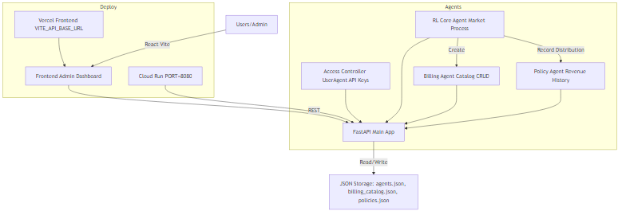

# Investor Brief — Omni Platform

## Executive Summary
Omni Platform delivers agent-driven FinOps and RL Core market services. The platform unifies Access control (UserAgent), Billing catalog, and Policy (Revenue) via consistent tenant-based keys and a simple JSON-backed persistence—fast to demo, easy to operate.

## Architecture Overview
- FastAPI backend (`omni-platform/backend`) with routers:
  - Access Controller: tenants, API key issuance, unified `UserAgent` profile.
  - Billing Agent: catalog list/add/update/delete with tenant-aware headers.
  - Policy Agent: `revenue/history` timeline for monetization/distribution.
  - RL Core: converts market trends into global catalog entries and appends revenue history.
- Frontend (Vite React) with Admin Dashboard:
  - Shows `revenue/history` and `billing/catalog` with PUT/DELETE.
  - Quick actions: "Generate from Market Data" and "Add Catalog Item".
  - Reads `VITE_API_BASE_URL` / `VITE_BACKEND_URL`.
- Storage: JSON files in `omni-platform/backend/data/` (`billing_catalog.json`, `policies.json`, `agents.json`).

## Agents & Capabilities
- Access Controller (UserAgent): `tenant_id` primary key across modules, fields include real name, billing address, contact email, compliance status.
- Billing Agent: global and tenant-specific catalog items; supports structured pricing.
- Policy Agent: records monetization/distribution events, enabling revenue timeline.
- RL Core: trend ingestion, automatic catalog service creation, policy history updates.

## Market Positioning
- Problem: Teams struggle to fast-track FinOps and AI agent monetization.
- Solution: A pragmatic platform that ships end-to-end (backend+frontend), with unified access, catalog ops, and RL-driven monetization.
- Differentiation: Rapid onboarding, transparent JSON persistence, plug-and-play API, and demo UI for investors and partners.

## GTM & Channels
- Listings: Acquire.com, Flippa, Product Hunt, Indie Hackers, GitHub Sponsors.
- Demo instances: Cloud Run (backend), Vercel (frontend). Quick onboarding via README.

## Monetization & Pricing
- Subscription tiers (Starter/Pro/Enterprise) priced per-tenant and per-agent.
- Usage-based addon for RL Core trend ingestion and catalog generation.
- Optional white-label admin UI.

## Valuation (Indicative)
- Inputs: working codebase, live demos, extensible architecture, early user traction.
- Method: Comparable marketplaces, ARR projections, growth potential of AI FinOps.
- Range: $150k–$500k depending on packaging, demos, and distribution.

## Roadmap
- Enhanced analytics and charts for revenue history.
- Multi-tenant isolation with optional DB backends.
- Marketplace integrations and automated deploy pipelines.

## Ask
- Seed support for scaling demos and listings.
- Sponsor pilots via GitHub Sponsors.
- Feedback on features and integrations.